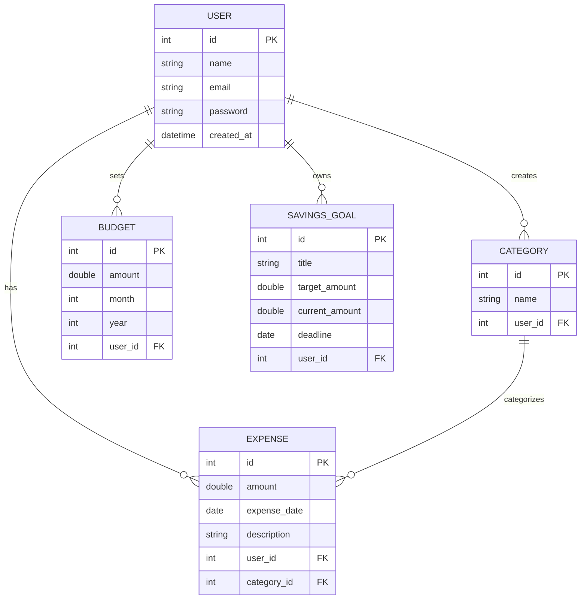

# BudgetWise - ER Diagram

```mermaid
erDiagram

    USER {
        int id PK
        string name
        string email
        string password
        datetime created_at
    }

    CATEGORY {
        int id PK
        string name
        int user_id FK
    }

    EXPENSE {
        int id PK
        double amount
        date expense_date
        string description
        int user_id FK
        int category_id FK
    }

    BUDGET {
        int id PK
        double amount
        int month
        int year
        int user_id FK
    }

    SAVINGS_GOAL {
        int id PK
        string title
        double target_amount
        double current_amount
        date deadline
        int user_id FK
    }

    USER ||--o{ EXPENSE : has
    USER ||--o{ CATEGORY : creates
    USER ||--o{ BUDGET : sets
    USER ||--o{ SAVINGS_GOAL : owns

    CATEGORY ||--o{ EXPENSE : categorizes
```
