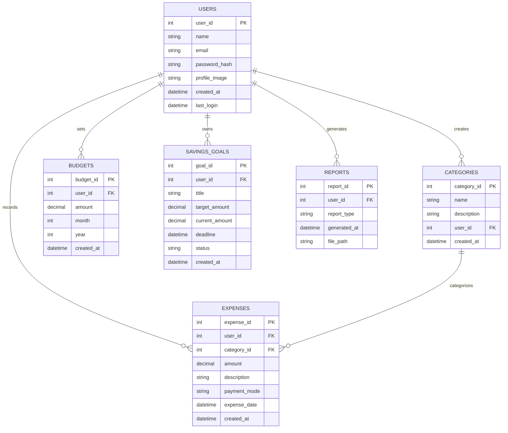

# BudgetWise - ER Diagram

```mermaid
erDiagram

    USERS {
        int user_id PK
        string name
        string email
        string password_hash
        string profile_image
        datetime created_at
        datetime last_login
    }

    CATEGORIES {
        int category_id PK
        string name
        string description
        int user_id FK
        datetime created_at
    }

    EXPENSES {
        int expense_id PK
        int user_id FK
        int category_id FK
        decimal amount
        string description
        string payment_mode
        datetime expense_date
        datetime created_at
    }

    BUDGETS {
        int budget_id PK
        int user_id FK
        decimal amount
        int month
        int year
        datetime created_at
    }

    SAVINGS_GOALS {
        int goal_id PK
        int user_id FK
        string title
        decimal target_amount
        decimal current_amount
        datetime deadline
        string status
        datetime created_at
    }

    REPORTS {
        int report_id PK
        int user_id FK
        string report_type
        datetime generated_at
        string file_path
    }

    USERS ||--o{ CATEGORIES : creates
    USERS ||--o{ EXPENSES : records
    USERS ||--o{ BUDGETS : sets
    USERS ||--o{ SAVINGS_GOALS : owns
    USERS ||--o{ REPORTS : generates

    CATEGORIES ||--o{ EXPENSES : categorizes
```
