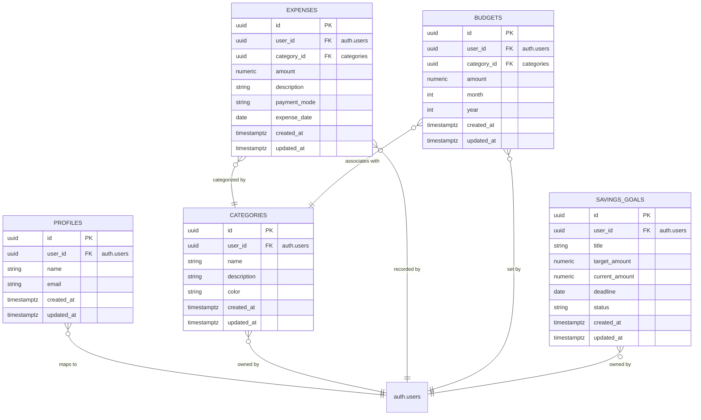

# BudgetWise - ER Diagram

```mermaid
erDiagram

    PROFILES {
        uuid id PK
        uuid user_id FK "auth.users"
        string name
        string email
        timestamptz created_at
        timestamptz updated_at
    }

    CATEGORIES {
        uuid id PK
        uuid user_id FK "auth.users"
        string name
        string description
        string color
        timestamptz created_at
        timestamptz updated_at
    }

    EXPENSES {
        uuid id PK
        uuid user_id FK "auth.users"
        uuid category_id FK "categories"
        numeric amount
        string description
        string payment_mode
        date expense_date
        timestamptz created_at
        timestamptz updated_at
    }

    BUDGETS {
        uuid id PK
        uuid user_id FK "auth.users"
        uuid category_id FK "categories"
        numeric amount
        int month
        int year
        timestamptz created_at
        timestamptz updated_at
    }

    SAVINGS_GOALS {
        uuid id PK
        uuid user_id FK "auth.users"
        string title
        numeric target_amount
        numeric current_amount
        date deadline
        string status
        timestamptz created_at
        timestamptz updated_at
    }

    PROFILES }o--|| "auth.users" : "maps to"
    CATEGORIES }o--|| "auth.users" : "owned by"
    EXPENSES }o--|| "auth.users" : "recorded by"
    EXPENSES }o--|| CATEGORIES : "categorized by"
    BUDGETS }o--|| "auth.users" : "set by"
    BUDGETS }o--|| CATEGORIES : "associates with"
    SAVINGS_GOALS }o--|| "auth.users" : "owned by"
```

