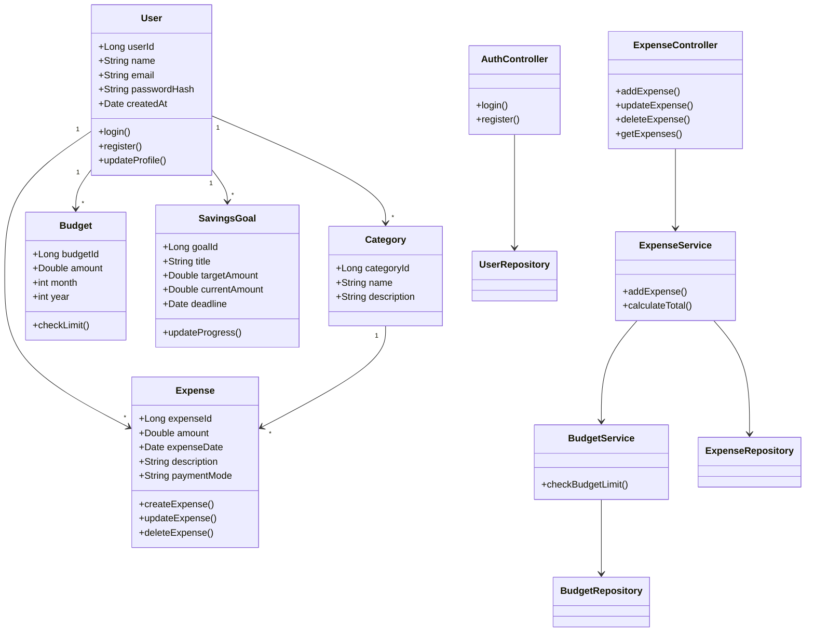

# BudgetWise - Class Diagram

```mermaid
classDiagram

    %% ================= ENTITIES =================

    class User {
        +Long userId
        +String name
        +String email
        +String passwordHash
        +Date createdAt
        +login()
        +register()
        +updateProfile()
    }

    class Expense {
        +Long expenseId
        +Double amount
        +Date expenseDate
        +String description
        +String paymentMode
        +createExpense()
        +updateExpense()
        +deleteExpense()
    }

    class Category {
        +Long categoryId
        +String name
        +String description
    }

    class Budget {
        +Long budgetId
        +Double amount
        +int month
        +int year
        +checkLimit()
    }

    class SavingsGoal {
        +Long goalId
        +String title
        +Double targetAmount
        +Double currentAmount
        +Date deadline
        +updateProgress()
    }

    %% ================= CONTROLLERS =================

    class AuthController {
        +login()
        +register()
    }

    class ExpenseController {
        +addExpense()
        +updateExpense()
        +deleteExpense()
        +getExpenses()
    }

    %% ================= SERVICES =================

    class ExpenseService {
        +addExpense()
        +calculateTotal()
    }

    class BudgetService {
        +checkBudgetLimit()
    }

    %% ================= REPOSITORIES =================

    class UserRepository
    class ExpenseRepository
    class BudgetRepository

    %% ================= RELATIONSHIPS =================

    User "1" --> "*" Expense
    User "1" --> "*" Category
    User "1" --> "*" Budget
    User "1" --> "*" SavingsGoal
    Category "1" --> "*" Expense

    AuthController --> UserRepository
    ExpenseController --> ExpenseService
    ExpenseService --> ExpenseRepository
    ExpenseService --> BudgetService
    BudgetService --> BudgetRepository
```
