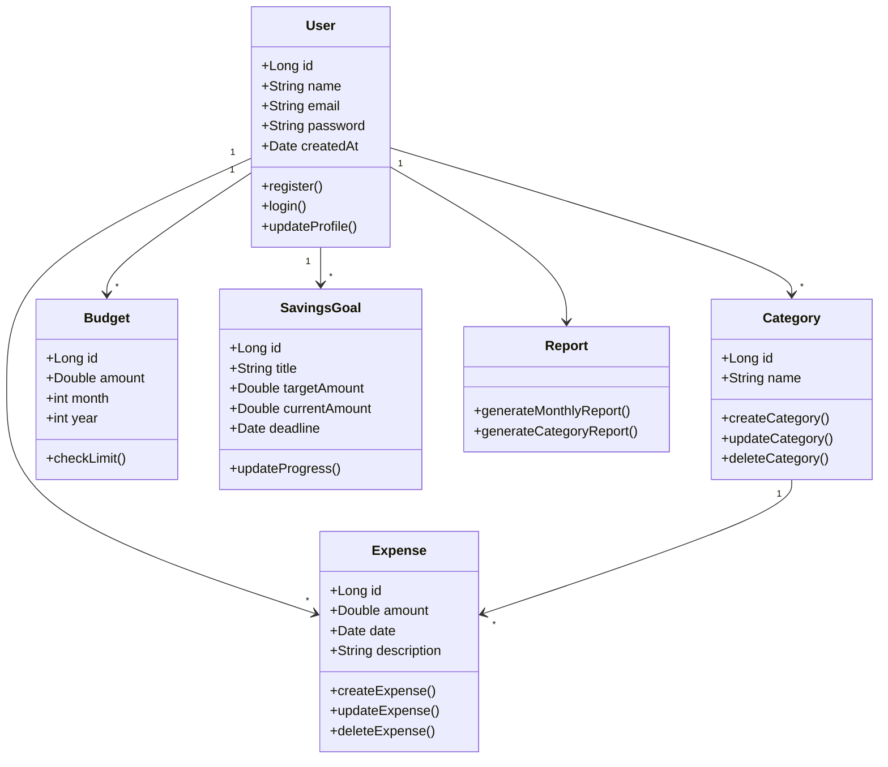

# BudgetWise - Class Diagram

```mermaid
classDiagram

    class User {
        +Long id
        +String name
        +String email
        +String password
        +Date createdAt
        +register()
        +login()
        +updateProfile()
    }

    class Expense {
        +Long id
        +Double amount
        +Date date
        +String description
        +createExpense()
        +updateExpense()
        +deleteExpense()
    }

    class Category {
        +Long id
        +String name
        +createCategory()
        +updateCategory()
        +deleteCategory()
    }

    class Budget {
        +Long id
        +Double amount
        +int month
        +int year
        +checkLimit()
    }

    class SavingsGoal {
        +Long id
        +String title
        +Double targetAmount
        +Double currentAmount
        +Date deadline
        +updateProgress()
    }

    class Report {
        +generateMonthlyReport()
        +generateCategoryReport()
    }

    User "1" --> "*" Expense
    User "1" --> "*" Category
    User "1" --> "*" Budget
    User "1" --> "*" SavingsGoal

    Category "1" --> "*" Expense

    User --> Report
```
