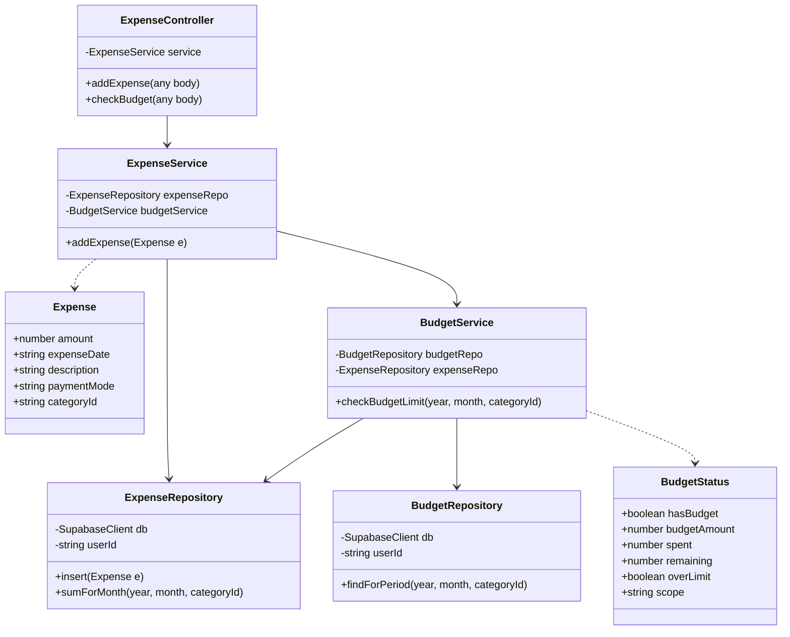

# BudgetWise - Class Diagram

```mermaid
classDiagram

    %% ================= ENTITIES =================

    class Expense {
        +number amount
        +string expenseDate
        +string description
        +string paymentMode
        +string categoryId
    }

    class BudgetStatus {
        +boolean hasBudget
        +number budgetAmount
        +number spent
        +number remaining
        +boolean overLimit
        +string scope
    }

    %% ================= REPOSITORIES =================

    class ExpenseRepository {
        -SupabaseClient db
        -string userId
        +insert(Expense e)
        +sumForMonth(year, month, categoryId)
    }

    class BudgetRepository {
        -SupabaseClient db
        -string userId
        +findForPeriod(year, month, categoryId)
    }

    %% ================= SERVICES =================

    class BudgetService {
        -BudgetRepository budgetRepo
        -ExpenseRepository expenseRepo
        +checkBudgetLimit(year, month, categoryId)
    }

    class ExpenseService {
        -ExpenseRepository expenseRepo
        -BudgetService budgetService
        +addExpense(Expense e)
    }

    %% ================= CONTROLLER =================

    class ExpenseController {
        -ExpenseService service
        +addExpense(any body)
        +checkBudget(any body)
    }

    %% ================= RELATIONSHIPS =================

    ExpenseController --> ExpenseService
    ExpenseService --> ExpenseRepository
    ExpenseService --> BudgetService
    BudgetService --> BudgetRepository
    BudgetService --> ExpenseRepository
    ExpenseService ..> Expense
    BudgetService ..> BudgetStatus
```

