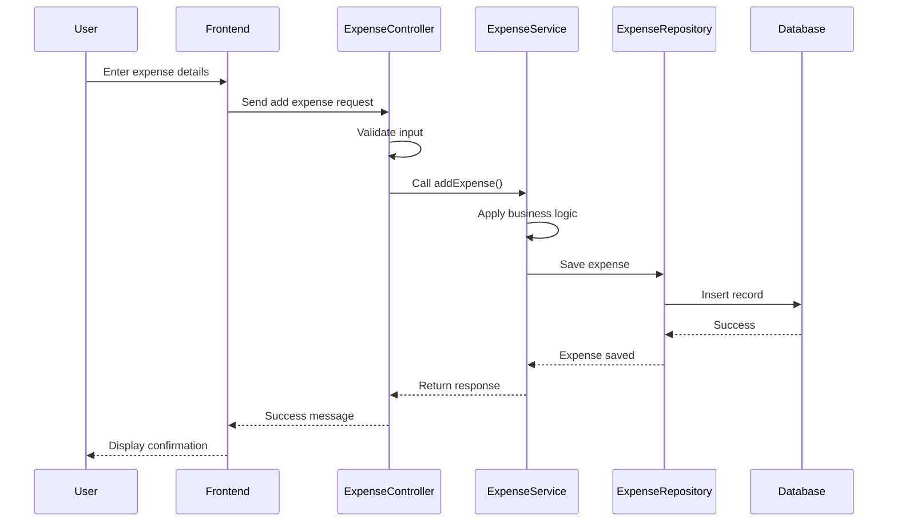

# BudgetWise - Sequence Diagram (Add Expense Flow)

```mermaid
sequenceDiagram
    participant U as User
    participant F as Frontend
    participant C as ExpenseController
    participant S as ExpenseService
    participant R as ExpenseRepository
    participant DB as Database

    U->>F: Enter expense details
    F->>C: Send add expense request
    C->>C: Validate input
    C->>S: Call addExpense()
    S->>S: Apply business logic
    S->>R: Save expense
    R->>DB: Insert record
    DB-->>R: Success
    R-->>S: Expense saved
    S-->>C: Return response
    C-->>F: Success message
    F-->>U: Display confirmation
```
