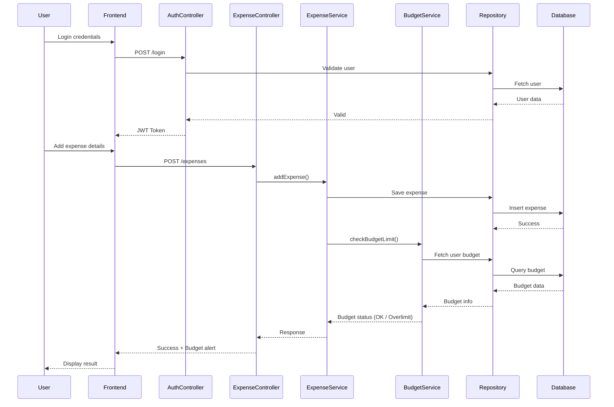

# BudgetWise - Sequence Diagram (Add Expense with Budget Check)

```mermaid
sequenceDiagram

    participant U as User
    participant F as Frontend
    participant AuthC as AuthController
    participant ExpC as ExpenseController
    participant ExpS as ExpenseService
    participant BudS as BudgetService
    participant Repo as Repository
    participant DB as Database

    U->>F: Login credentials
    F->>AuthC: POST /login
    AuthC->>Repo: Validate user
    Repo->>DB: Fetch user
    DB-->>Repo: User data
    Repo-->>AuthC: Valid
    AuthC-->>F: JWT Token

    U->>F: Add expense details
    F->>ExpC: POST /expenses
    ExpC->>ExpS: addExpense()

    ExpS->>Repo: Save expense
    Repo->>DB: Insert expense
    DB-->>Repo: Success

    ExpS->>BudS: checkBudgetLimit()
    BudS->>Repo: Fetch user budget
    Repo->>DB: Query budget
    DB-->>Repo: Budget data
    Repo-->>BudS: Budget info

    BudS-->>ExpS: Budget status (OK / Overlimit)
    ExpS-->>ExpC: Response
    ExpC-->>F: Success + Budget alert
    F-->>U: Display result
```
