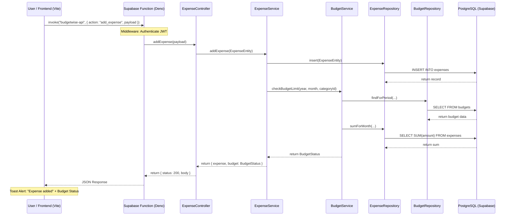

# BudgetWise - Sequence Diagram

```mermaid
sequenceDiagram
    participant U as User / Frontend (Vite)
    participant SF as Supabase Function (Deno)
    participant EC as ExpenseController
    participant ES as ExpenseService
    participant BS as BudgetService
    participant ER as ExpenseRepository
    participant BR as BudgetRepository
    participant DB as PostgreSQL (Supabase)

    U->>SF: invoke("budgetwise-api", { action: "add_expense", payload })
    Note over SF: Middleware: Authenticate JWT
    SF->>EC: addExpense(payload)
    EC->>ES: addExpense(ExpenseEntity)
    
    ES->>ER: insert(ExpenseEntity)
    ER->>DB: INSERT INTO expenses
    DB-->>ER: return record
    
    ES->>BS: checkBudgetLimit(year, month, categoryId)
    BS->>BR: findForPeriod(...)
    BR->>DB: SELECT FROM budgets
    DB-->>BR: return budget data
    
    BS->>ER: sumForMonth(...)
    ER->>DB: SELECT SUM(amount) FROM expenses
    DB-->>ER: return sum
    
    BS-->>ES: return BudgetStatus
    ES-->>EC: return { expense, budget: BudgetStatus }
    EC-->>SF: return { status: 200, body }
    SF-->>U: JSON Response
    Note over U: Toast Alert: "Expense added" + Budget Status
```

