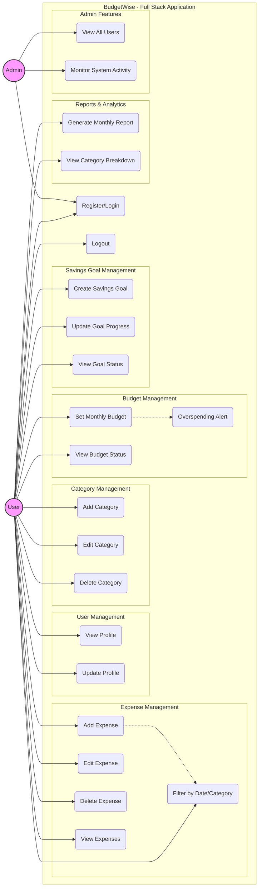

# BudgetWise - Use Case Diagram

```mermaid
graph LR
    %% Actors
    U((User))
    A((Admin))

    %% System Boundary
    subgraph System["BudgetWise - Full Stack Application"]
        direction TB
        
        UC1(Register/Login)
        UC2(Logout)

        subgraph UserMgmt["User Management"]
            UC3(View Profile)
            UC4(Update Profile)
        end

        subgraph ExpenseMgmt["Expense Management"]
            UC5(Add Expense)
            UC6(Edit Expense)
            UC7(Delete Expense)
            UC8(View Expenses)
            UC9(Filter by Date/Category)
        end

        subgraph CategoryMgmt["Category Management"]
            UC10(Add Category)
            UC11(Edit Category)
            UC12(Delete Category)
        end

        subgraph BudgetMgmt["Budget Management"]
            UC13(Set Monthly Budget)
            UC14(View Budget Status)
            UC15(Overspending Alert)
        end

        subgraph SavingsMgmt["Savings Goal Management"]
            UC16(Create Savings Goal)
            UC17(Update Goal Progress)
            UC18(View Goal Status)
        end

        subgraph Reports["Reports & Analytics"]
            UC19(Generate Monthly Report)
            UC20(View Category Breakdown)
        end

        subgraph AdminFeatures["Admin Features"]
            UC21(View All Users)
            UC22(Monitor System Activity)
        end
    end

    %% Actor Styles
    style U fill:#f9f,stroke:#333,stroke-width:2px
    style A fill:#f9f,stroke:#333,stroke-width:2px

    %% User Relationships
    U --> UC1
    U --> UC2
    U --> UC3
    U --> UC4
    U --> UC5
    U --> UC6
    U --> UC7
    U --> UC8
    U --> UC9
    U --> UC10
    U --> UC11
    U --> UC12
    U --> UC13
    U --> UC14
    U --> UC16
    U --> UC17
    U --> UC18
    U --> UC19
    U --> UC20

    %% Include relationship (dashed)
    UC13 -.-> UC15
    UC5 -.-> UC9

    %% Admin Relationships
    A --> UC1
    A --> UC21
    A --> UC22
```
