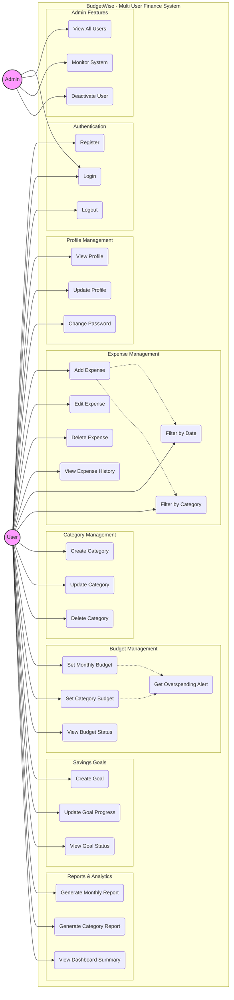

# BudgetWise - Use Case Diagram

```mermaid
graph LR

    %% Actors
    U((User))
    A((Admin))

    %% System Boundary
    subgraph System["BudgetWise - Multi User Finance System"]
        direction TB

        %% Authentication
        subgraph Auth["Authentication"]
            UC1(Register)
            UC2(Login)
            UC3(Logout)
        end

        %% Profile
        subgraph Profile["Profile Management"]
            UC4(View Profile)
            UC5(Update Profile)
            UC6(Change Password)
        end

        %% Expense Module
        subgraph ExpenseModule["Expense Management"]
            UC7(Add Expense)
            UC8(Edit Expense)
            UC9(Delete Expense)
            UC10(View Expense History)
            UC11(Filter by Date)
            UC12(Filter by Category)
        end

        %% Category Module
        subgraph CategoryModule["Category Management"]
            UC13(Create Category)
            UC14(Update Category)
            UC15(Delete Category)
        end

        %% Budget Module
        subgraph BudgetModule["Budget Management"]
            UC16(Set Monthly Budget)
            UC17(Set Category Budget)
            UC18(View Budget Status)
            UC19(Get Overspending Alert)
        end

        %% Savings Module
        subgraph SavingsModule["Savings Goals"]
            UC20(Create Goal)
            UC21(Update Goal Progress)
            UC22(View Goal Status)
        end

        %% Reports
        subgraph Reports["Reports & Analytics"]
            UC23(Generate Monthly Report)
            UC24(Generate Category Report)
            UC25(View Dashboard Summary)
        end

        %% Admin Module
        subgraph AdminModule["Admin Features"]
            UC26(View All Users)
            UC27(Monitor System)
            UC28(Deactivate User)
        end
    end

    %% Styling
    style U fill:#f9f,stroke:#333,stroke-width:2px
    style A fill:#f9f,stroke:#333,stroke-width:2px

    %% User Relations
    U --> UC1
    U --> UC2
    U --> UC3
    U --> UC4
    U --> UC5
    U --> UC6
    U --> UC7
    U --> UC8
    U --> UC9
    U --> UC10
    U --> UC11
    U --> UC12
    U --> UC13
    U --> UC14
    U --> UC15
    U --> UC16
    U --> UC17
    U --> UC18
    U --> UC20
    U --> UC21
    U --> UC22
    U --> UC23
    U --> UC24
    U --> UC25

    %% Include / Extend Relationships
    UC16 -.-> UC19
    UC17 -.-> UC19
    UC7 -.-> UC11
    UC7 -.-> UC12

    %% Admin Relations
    A --> UC2
    A --> UC26
    A --> UC27
    A --> UC28
```
